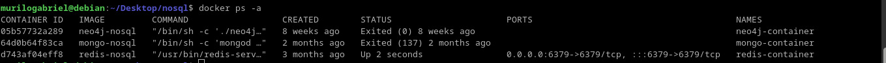
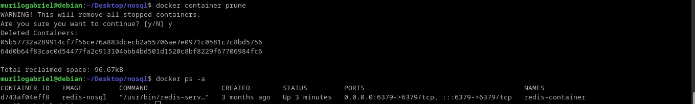
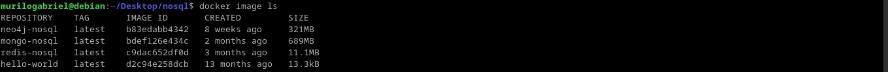
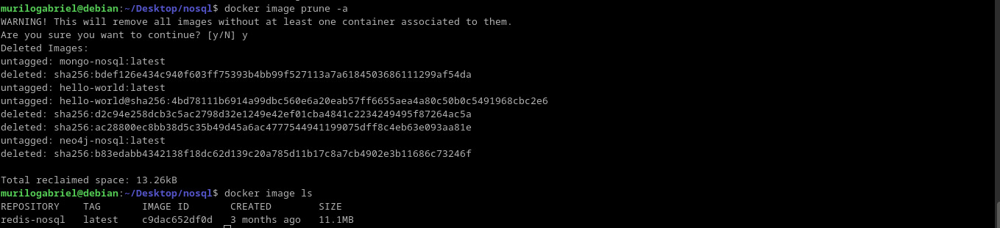

# Definitions and basic concepts
Basic commands for Docker, remembering that it can be accomplished by interacting with Docker Engine in three ways: CLI, REST API and Docker Deamon.

All that CLI and REST API does is to abstract instructions given to the Docker Deamon's proccess.

## Exercise 1.1: Getting started
Three containers were already created by my NoSQL classes, as given:

I just started the redis container and remained the others stopped. So, I cleaned these with the *prune* command:

As expected, only the active container remained. For the images, I listed it all:

Then I executed the *prune* command for these images:
~~~console
docker image prune
~~~
However, it did not cleaned nothing at all. Then I concluded that it only deletes dangling images, that is the ones that don't have **SHA256 digest** attached to it. In other words, your hash identifier. It is done when the image does not have a child image, like *ubuntu:latest* or builded without a tag(references the hash identifier).

So to actually delete the unused images, I used the command:
~~~
docker image prune -a
~~~
It deletes everything that is in dangling state or not used:

