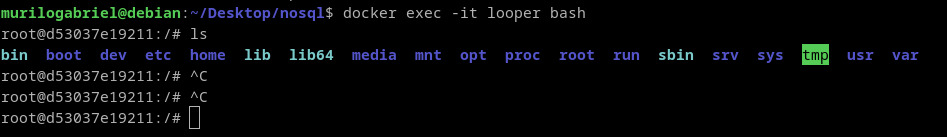
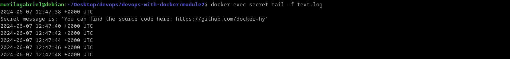
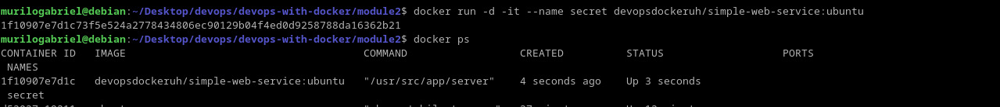
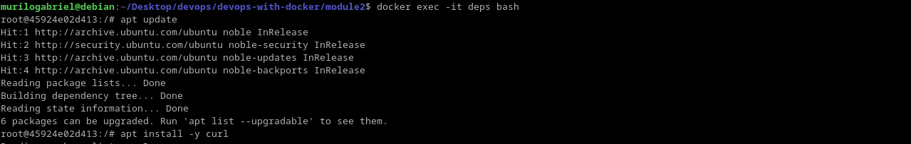
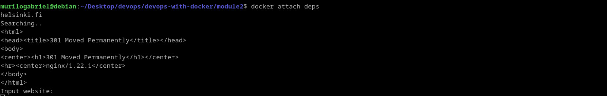

# Running and stopping containers
Learning some more commands and options to interact with the containers. Some interesting commands introduced were:
~~~bash
docker logs
docker attach
~~~
The first one retrieves logs from container execution. A bunch of options are important to manipulate them:
~~~bash
docker logs --follow #keeps track of STDOUT and STDERR
docker logs --timestamps #show timestamps of each log
docker logs --tail 5 #show the last five logs
~~~
The second one is important when a container is started at detached mode. So it reattach it to the current shell, *--no-stdin* can be passed so the STDIN from the shell is not applied.

Furthermore, as shown, when interacting with the container, it does not receives signals from shell's STDIN:

Or we exit the shell, or we pass **CTRL+P+Q** to dettach the container TTY.

## Exercise 1.3: Secret message

I execute the container by the image given in detached mode:

Then I simply executes the *tail* command with *docker exec*:

## Exercise 1.4: Missing dependencies

First I run the container and pass shell commands to be executed in your initialization:

But, as we can see, the *curl* command is not yet installed. So exited the application with Ctrl+P+Q shortcut, then I enter to the container by the *exec* command, and update it:

Finally, we can grasp the HTML code from the URL page by reattaching the application:

Other way to achieve this is to install the dependencies before the container is even initialized. For doing so, maybe passing a shell command to update and install curl, or at the image level by giving instructions to do so.
