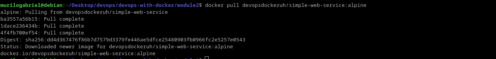
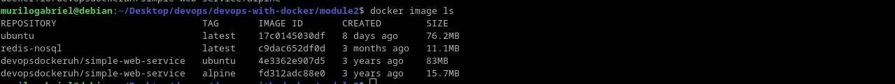
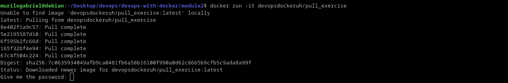
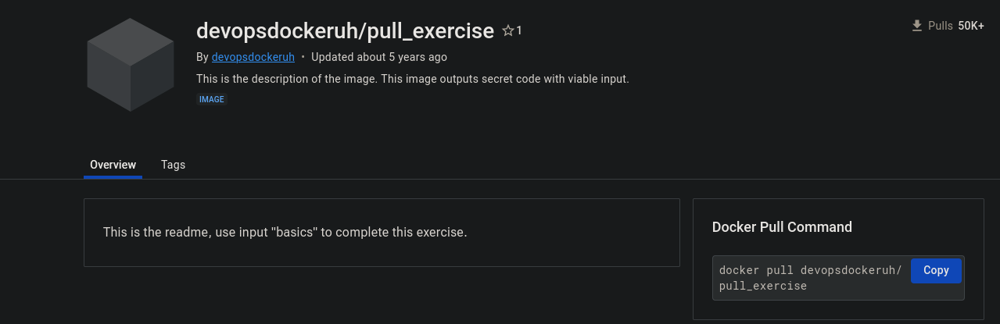
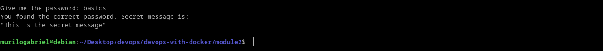
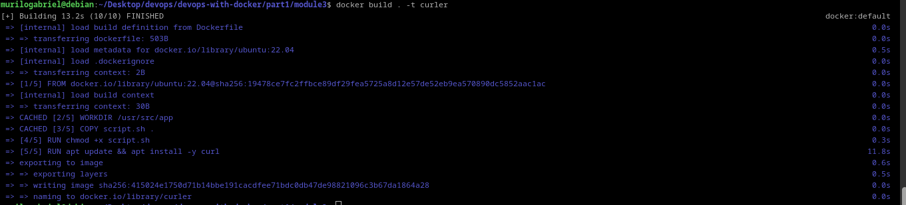
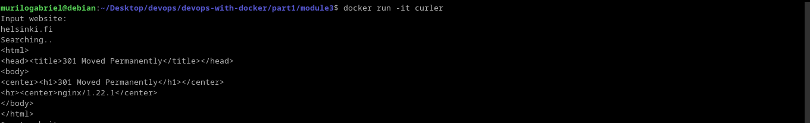
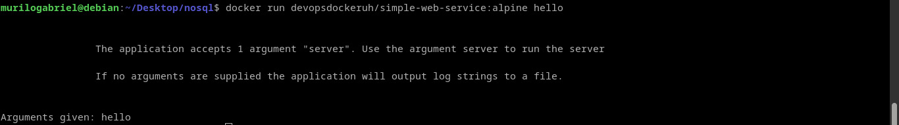
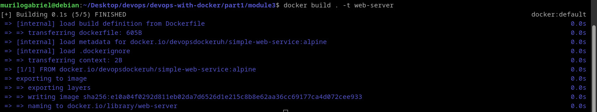
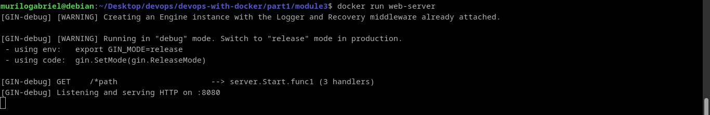

# In-depth dive into images

Official and automated images are introduced by the image marketplace **Docker Hub**. They are pulled and specified by your tag, to build in a given version, for example:
~~~
docker pull ubuntu::22.04
~~~
A image of Ubuntu 22.04 LTS version will be build. Official images can be found by the command *search*, not necessary from Docker Hub's platform:
~~~console
docker search ubuntu
~~~

Furthermore, Dockerfile has your introduction in a way to build custom images.

## Exercise 1.5 - Sizes of images

First I pull the alpine image:

The build process is separated in layers to optimize your installation. Describing the images can show how the alpine image is much lighter:

## Exercise 1.6 - Hello Docker Hub

Initiate running the image not yet built, so it will search it on Docker Hub:

In your Docker Hub's page, we can see the instruction:

I did not get where I can read the Dockerfile though. So I input "basics" to the application:

## Exercise 1.7 - Image from script

Some cool commands were presented to levarage the in layers architecture to build containers. As shown, caching capabilities are disposed when using layered building process:

~~~bash
docker cp file container:directory #pass local files to the container's directory, it does not persist!

docker diff container #check which files were included, altered or deleted

docker commit source-container new-image #create a image based on the modified container

docker build . -t container:tag #new features can be applied by versioning with tags
~~~

First, I build the image named curler with the necessary dependencies:

On top of ubuntu image, layered operations are executed. Then, let's test the app:

## Exercise 1.8 - Two line Dockerfile

As explained, the application declares an **ENTRYPOINT** to specify which executable is going to take charge. Then, **CMD** can be runned to pass parameters to the executable in your _exec form_:

~~~dockerfile
CMD["parameter1", "parameter2"]
#default parameters to ENTRYPOINT
~~~

By testing the *docker run* command passing *hello* as parameter, we get the error:

Then, is enough just pass *server* as parameter. The Dockerfile is refined:

 ~~~dockerfile
FROM devopsdockeruh/simple-web-service:alpine
CMD ["server"]
~~~

Build the image tagged web-server:

Because the image was already cached, was fast build this container. Right away, test the application:

