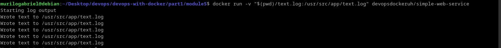
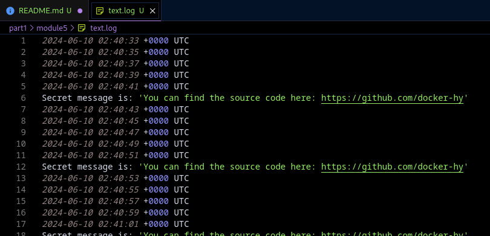
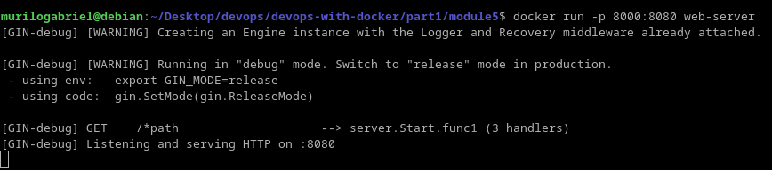
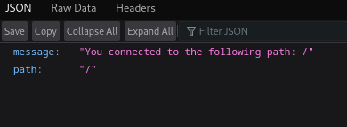

# Interacting with the container via volumes and ports

In this module, we work with persisting data inside the container.

**1. Bind volume:**

At execution time we can give a volume to be mounted from our local directory. This is the easiest way to share files to the application running in the container:
~~~bash
docker run -v "local_dir:remote_dir" container
~~~

## Exercise 1.9: Volumes
Firstly, we need to bind the *text.log* file into our system. The image were already built, so just need to pass the volume. However, there were problems because it created directories. So I must create the *text.log* file on my system to before bind it to the remote directory:

Checking the log results:

## Exercise 1.10: Ports open

Some network principles were introduced. Is interesting to map the host port to the container port so to communicate with each other. In other terms, communication done in host port by any means will repass to the container.

This is done by exposing container's ports in the build file. For Dockerfile, *EXPOSE* command will do:
~~~dockerfile
EXPOSE <port>/<protocol>
~~~
 After that, publish the host port at the build time:
~~~bash
docker run -p <host-port>:<container-port>/<protocol> app-in-port
#for security reasons, it's possible to retain the source IP addresses ranges when publishing the port by giving <source-ip>:<host-port>
~~~

For that exercise, the image were already built. So, it was just needed to map the ports from host and container with the command line:

Testing in browser:

