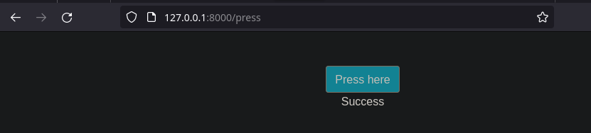

# Utilizing tools from the Registry

We will learn how to containerize an application building your dependencies from the scratch.

## Exercise 1.11: Spring

Firstly, we search for Java Spring images supported by Amazon Corretto. The instructions tell us that Java 8 is needed. So, the image *amazoncorretto:8-alpine3.16* was choosen because of your minimal size.
~~~dockerfile
FROM amazoncorretto:8-alphine3.16
~~~

Then, we expose the port to establish communication by the host machine:
~~~dockerfile
EXPOSE 8080
~~~

Therefore, just need to copy the local files to the container and run the commands:
~~~dockerfile
WORKDIR /usr/src/app
COPY . .
RUN ./mvnw package
CMD java -jar ./target/docker-example-1.1.3.jar
~~~

Building the image:

Running the container publishing the host port:

Finally, checking on browser:

## Exercise 1.12: Hello, frontend!

To package and containerize the frontend, at start we read the instructions given by the README. In that way, the *Node.js* need to be installed, rather the version 16.

For that, the Dockerfile is built by the official **node:16-alpine**:
~~~dockerfile
FROM node:16-alpine
~~~

Then, expose the port, pass the files and run the commands:
~~~dockerfile

EXPOSE 5000

WORKDIR /usr/src/app

COPY . .

RUN npm install
RUN npm run build && npm install -g serve

CMD serve -s -l 5000 build
~~~

Testing the container and publishing a host port:

Then, in the browser:

## Exercise 1.13: Hello, backend!

As the same way did for the frontend, for the backend we start searching for Go official images in Docker Hub. In README, is instructed to install Go 1.16 version:
~~~dockerfile
FROM golang:1.16
#alpine version gives gcc error because it is not installed, so changed to the full image version
~~~
Exposing the port and establishing the working directory. Moreover, it's needed to declare a environment variable that represents the URL for CORS check:
~~~dockerfile
EXPOSE 8080

WORKDIR /usr/src/app
ENV REQUEST_ORIGIN="https://backend"
~~~
Then, pass the files and run the commands:
~~~dockerfile
COPY . .

RUN go build && go test .

CMD ./server
~~~

Building the image:

Running the container by publishing the host's port 8000:

Finally, checking on browser:

## Exercise 1.14: Environment

To establish communication between the applications, the environtment variables are changed:

~~~dockerfile
#Frontend
ENV REACT_APP_BACKEND_URL="http://localhost:8000"
#mapping the ports like 8000:8080 on backend

#Backend
ENV REQUEST_ORIGIN="http://localhost.com:5000"
#frontend is allocated at port 5000 by the host
~~~

Then, these two applications are set running with the commands:

~~~bash
docker run -p 8000:8080 example-backend
docker run -p 5000:5000 example-frontend
~~~

Therefore, it remains checking the connection:

At the backend application:

## Exercise 1.15: Homework

During my NoSQL classes, we built a simple Dockerfile for a Redis image:
~~~dockerfile
FROM alpine:latest

RUN apk --update --no-cache add redis
RUN mkdir /data && chown redis:redis /data

COPY redis.conf /redis.conf

EXPOSE 6379
VOLUME /data

WORKDIR /data
CMD ["/usr/bin/redis-server", "/redis.conf"]
~~~

It's necessary to pass the *redis.conf* file to specify features for the Redis database.

I already built this image by the name *aula-redis*, so I renamed it:

~~~bash
docker tag aula-redis muriloleal/redis-image
~~~

Then, pushed it:
~~~bash
docker push muriloleal/redis-image
~~~

On Docker Hub's page:

See it: [redis-image](https://hub.docker.com/r/muriloleal/redis-image)

## Exercise 1.16: Cloud Deployment

I will start a EC2 instance, pull the image from https://hub.docker.com/r/devopsdockeruh/coursepage and then test the application.

Firtly, I create a EC2 instance capable of receive SSH and HTTP traffic:

Next, I enter to the instance terminal and install Docker. It's documented in their webpage:

~~~bash
#command to install Docker
curl -fsSL https://get.docker.com -o get-docker.sh
~~~

Then, start it in the system and pull the image:
~~~bash
systemctl start docker
docker pull devopsdockeruh/coursepage
~~~

Therefore, it's just needed to start the application by publishing the host port:

Testing in browser by giving the instance Public IP:

