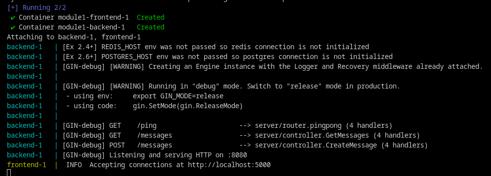

# Migrating to Docker Compose

Until now, the proposal of building images by the Dockerfile and pulling from Docker Hub was the only alternative. However, for multi-container applications, **Docker Compose** is the real tool.

Your implementation is based as a *.yml* file, the documentation can help: [docker compose docs](https://docs.docker.com/compose/compose-file/). It's really specfial for web services, where the multi-container environment really applies.

## Exercise 2.1

As discussed, the configuration is made in the *.yml* style. So, it's needed to pass the image from Docker Hub and a volume from the host to persist the logs:

~~~yml
image: devopsdockeruh/simple-web-service
volumes: 
     - ./text.log:/usr/src/app/text.log
~~~

Then, by the command **docker compose up** the container already gets started:

Checking the log on the file:

## Exercise 2.2

The **command** field can replace the *CMD* from Dockerfile and pass as a parameter to the main executable:

~~~yml
ports:
      - 8080:8080
command: server
~~~

With *docker compose up*, the server is running:

Testing in the browser:

## Exercise 2.3

With the Dockerfiles already made, it's just needed to pass the directory so that the *docker-compose* can build both images. Remember, map the ports that needs to be published:
~~~yml
frontend-compose:
    build: example-frontend/
    ports:
        - 5000:5000
backend-compose:
    build: example-backend/
    ports:
        - 8000:8080
~~~

Then, by the command *docker compose up*, your logs shows that it was successfully done:

Testing on the browser:

Funny thing is that they stop together, as a whole application:

