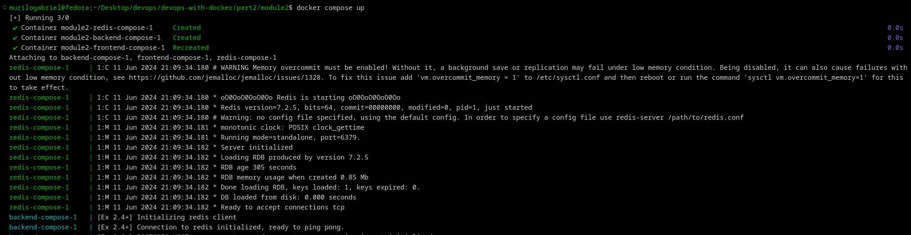
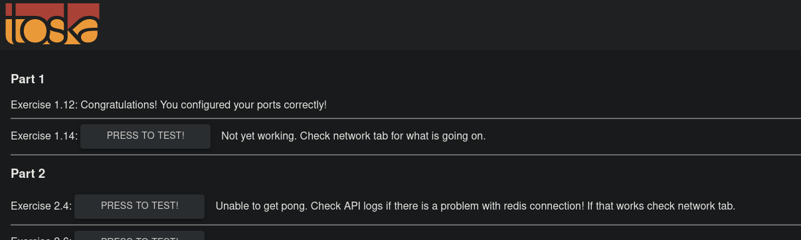
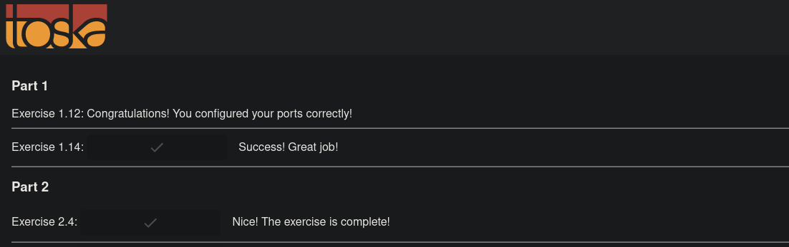
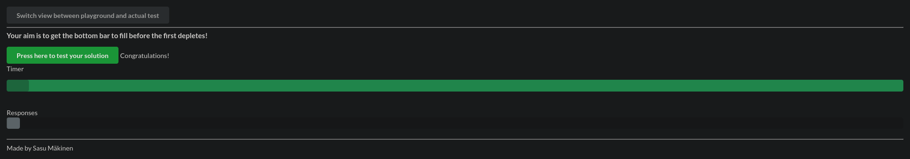
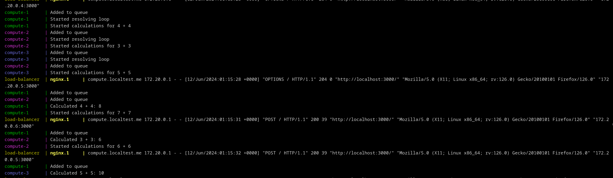

# Docker networking

Docker containers reference each other with their respective DNS, established by the names given in the **docker-compose.yml** file as service names. It's trivial if they are at the same docker-compose scope.

## Exercise 2.4

As discussed, a container IP built in docker-compose can be referenced by it's service name. So, the environment variables at Dockerfile for both frontend and backend are removed to make them connect on *docker compose up* command:
~~~dockerfile
ENV REACT_APP_BACKEND_URL="http://localhost:8000" #commented in frontend's Dockerfile
ENV REQUEST_ORIGIN="http://localhost:5000" #commented in backend's Dockerfile
~~~

Then, introduced at the docker-compose.yml file to build a **redis** image to cache API requests and pass the host as environment variable to the backend:
~~~yml
#for the frontend
environment:
    - REACT_APP_BACKEND_URL=http://backend-compose:8000

#for the backend
environment:
    - REDIS_HOST=redis-compose
    - REQUEST_ORIGIN=http://frontend-compose:5000
~~~

It's not necessary anymore to publish host port for the backend. Right away, test with *docker compose up*:

Checking on the frontend endpoint:

An error occurred because I think the frontend and backend exchange their environment variables at build time, neither if I pass *localhost* as the IP address, still not work. Therefore, I uncommented the *ENV* commands from Dockerfile and built the images again by the command:

~~~bash
docker compose build --no-cache
~~~

Finally, the frontend endpoint says that it's working:

## Exercise 2.5

Custom networks can be made in docker compose file. By default, all containers communicate wich each other by their service names, but a manual network can give benefit to separate applications:
~~~yml
services:
    db:
        networks:
            - custom-network #db service is into custom network
    networks:
        custom-network:
            name: custom #actual name
~~~
To communicate **between** docker-compose networks, external field must be given:
~~~yml
services:
    db:
        networks:
            - custom-network
    networks:
        custom-network:
            external:
                name: custom-network #must be the same name
~~~
The docker compose already has a **default** network, and it can be modified by adding a field with the same name to *networks*.

To scale multiple instances from the same image, **--scale** parameter allows that:
~~~bash
docker compose up --scale webapp=3
#three containers will be created from webapp image
~~~
This leverages some cool commands, like which port they are indexed on the host:
~~~yml
#remember, the port cannot be the same to scale because it turns occupied
ports:
    - 8000 #a random free port from the host will be given
~~~
Then, list the ports given:
~~~bash
docker compose port --index 1 webapp 8000
docker compose port --index 2 webapp 8000
docker compose port --index 3 webapp 8000
~~~

To evitate concurrency for ports, a load balancer is the most suitable way. For that, the socket in use by Docker deamon must give privileges to the load balancer so that he can route requests to the instances. The docker compose must follow:
~~~yml
services:
    proxy:
        image: nginx-proxy
        volumes:
            - /var/run/docker.sock:/tmp/docker.sock:ro
            #container can access the socket in read-only mode
        ports:
            - 80:80
~~~
However, it's needed to declare the full qualified name of the services in a way the load balancer can invoke:
~~~txt
www.shop.example.com
- .com : top-level domain
- example : second-level domain name
- shop : subdomain #differentiate services within a domain(namespaces)
- www : hostname
~~~
In that way, it's given the environment variable **VIRTUAL_HOST** to specify the domain of the application to the load balancer. The **VIRTUAL_PORT** is needed if the port of the application was not already exposed:

~~~yml
services:
    webapp:
        build: .
        environment:
            - VIRTUAL_HOST=webapp.localtest.me
            - VIRTUAL_PORT=8080 #if not exposed
    proxy:
        image: nginx-proxy
        volumes:
            - /var/run/docker.sock:/tmp/docker.sock:ro
            #container can access the socket in read-only mode
        ports:
            - 80:80
~~~

By running the scaling exercise, we see that just one instance of the compute image is not enough to calculate the sums before the timer ends. Therefore, it needs to scale!

At some research, I found that the **scale** field in the docker compose can specify how much containers the service should run. So, just added:

~~~yml
compute:
      image: devopsdockeruh/scaling-exercise-compute
      environment:
        - VIRTUAL_HOST=compute.localtest.me
      scale: 3
~~~

The load balancer should be able to route the traffic between the three instances. Calculating we get the success message:

The parallelism between the instances were achieved by looking into the logs:

