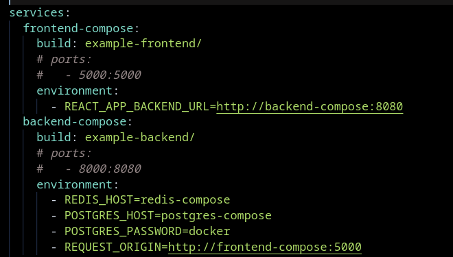

# Volumes in action

When building an image, persisting data is important. The Dockerfile has an instruction named **VOLUME**, but it just specify a volume in container-side path. In host-side path, the volumes are persisted in */var/lib/docker/volumes* with a long hash ID. The command to show all the volumes attached is:
~~~console
docker volume ls
~~~
 In my computer:
 

 We do not manage this volumes. The file *docker-compose.yml* allows to indicate a preferable host path to persist data generated from the container:
 ~~~yml
 services:
    db:
        volumes:
            - database:/var/lib/database/data
~~~

It allows to storage data even if the container is stopped.

## Exercise 2.6

At PostgreSQL Docker Hub's page, some important environment variables are illustrated:
~~~txt
POSTGRES_PASSWORD : password to authenticate to the database (REQUIRED)
POSTGRES_USER : defines a user to authenticate
POSTGRES_DB : defines which database is going to be used
~~~

For *docker-compose.yml*, we will just pass the POSTGRES_PASSWORD:

~~~yml
postgres-compose:
    image: postgres:alpine
    environment:
      - POSTGRES_PASSWORD=docker
~~~

The backend instructions clarifies that a bunch of environment variables are needed to the application connects to the PostgreSQL database:

~~~txt
POSTGRES_HOST (port default is 5432)
POSTGRES_USER (default is postgres)
POSTGRES_PASSWORD (default is postgres)
POSTGRES_DATABASE (default is postgres)
~~~

The variables POSTGRES_HOST and POSTGRES_PASSWORD will be enough. Empashis that hostnames are shared as service's names on docker compose file:
~~~yml
backend-compose:
    build: example-backend/
    ports:
      - 8000:8080
    environment:
      - REDIS_HOST=redis-compose
      - POSTGRES_HOST=postgres-compose
      - POSTGRES_PASSWORD=docker
~~~

Running *docker compose up*, we get on the frontend's page:

## Exercise 2.7

We persist data by the *volumes* field in docker compose file and declaring it at the end:
~~~yml
postgres-compose:
    #. . .
    volumes:
      - database:/var/lib/postgresql/data
volumes:
    database:
~~~

Running *docker compose -d up*, we send messages through the frontend's endpoint:

Stopping with *docker compose down* and starting it again, we check that the messages were saved:

Listing all the volumes:

The first one is attached to the Redis instance. Deleting the **module3_database** and checking the messages again, we get:

They were not persisted...

## Exercise 2.8

We start creating the *nginx.conf* file and altering the endpoints for frontend and backend. We must highlight that the proxy is in the same network with the other services, so their IP addresses are referenced by their service's name:

Then, it's needed to pass the file into the **reverse proxy container** created at *docker-compose.yml*. It's important to remember that the sockets pointed by Docker must be read by the proxy:

~~~yml
reverse-proxy:
    image: nginx:alpine
    volumes:
      - /var/run/docke.sock:/tmp/docker.sock:ro #read docker sockets
      - nginx.conf:/etc/nginx/nginx.conf #pass conf file
    ports:
      - 80:80
~~~

Running *docker compose up* and testing on browser at the proxy's endpoint:

An error occurred.This is because the proxy communicates with the other services internally, so it's based on the **container's exposed port**. Moreover, the API for *ping* is located at *http://localhost/api/ping?*, for that is must be modified in *nginx.conf* file:

Therefore, testing at proxy's page:

## Exercise 2.9

The load balancer should be able to route traffic between the frontend and backend. In this way, it's not needed to these instances be accessible from external requests. That said, I start removing the *ports* field of them to not publish it:

If is not accessible anymore, the communication between the instaces are now made internally at Docker compose's network. For that, the **environment variables** are changed. Then, I first comment the *ENV* instruction for both frontend and backend:

~~~dockerfile
ENV REACT_APP_BACKEND_URL="http://localhost:8000" #commented in frontend
ENV REQUEST_ORIGIN="http://localhost:5000" #commented in backend
~~~

Doing so, I rebuild the images with the command:
~~~bash
docker compose build --no-cache
~~~

Finally, I pass these variables at the docker compose level. It's important to remember that the IP address and port are now the ones in the docker compose scope(service name and port exposed, respectively):

However, we must point to the proxy some APIs to get requests persisted with Redis and PostgreSQL on the backend's side. For that, at *nginx.conf* file, I add:
~~~nginx
  location /api/ping?redis=true/ {
    proxy_set_header Host $host;
    proxy_pass http://backend-compose:8080/ping?redis=true;
  }

  location /api/ping/?postgres=true/ {
    proxy_set_header Host $host;
    proxy_pass http://backend-compose:8080/ping?postgres=true/;
  }
~~~

Therefore, I can test on browser by running *docker compose up*:

It's all running without exposing the applications!

## Exercise 2.10

Accidentally(or not), the ports were already prevented to the external access in [past exercise](#exercise-29):

I don't know where this 631 port publication came from, maybe from another instance that I already built?

