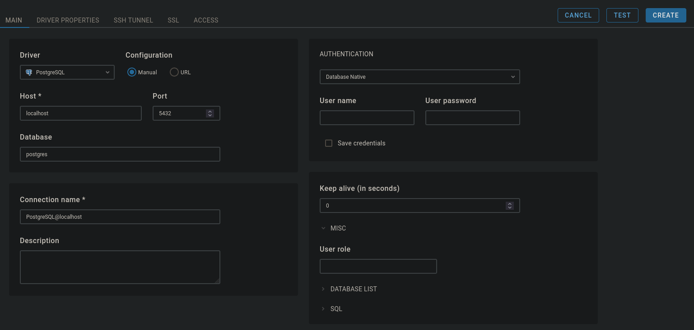

# Containers in development

In this module, we are basically applying all the stuff learned at this part. I wish to build a monitoring architecture for multiple databases used in an application. For that, I know that DBeaver is a tool with wide list of supported databases.

In that way, I found the **CloudBeaver** image for Docker that works similarly but as an HTML page. So, I will use some instances already introduced in this course to monitor.

To not expose these servers, I will use **Traefik**, a reverse proxy that is similar to Nginx but improved for use of microservices.

## Exercise 2.11

At first, I will just use the PostgreSQL and Redis databases already known by past exercises:

~~~yml
postgres-compose:
    image: postgres:alpine
    restart: unless-stopped
    environment:
      - POSTGRES_PASSWORD=docker
    volumes:
      - postgres:/var/lib/postgresql/data
redis-compose:
    image: redis:alpine
    restart: always
    command: redis-server --save 60 1 --requirepass docker #require password and persist data
    volumes:
      - cache:/data
~~~

Then, I insert the CloudBeaver image:

~~~yml
cloudbeaver:
    image: dbeaver/cloudbeaver
    restart: unless-stopped
    volumes:
      - cloudbeaver:/opt/cloudbeaver/workspace
    depends_on:
      - postgres-compose
      - redis-compose
~~~

The *depends_on* field guarantee that the database servers are built first. After that, I need to study how the Traefik proxy is created. From some search, a **traefik.yml** file is at the same scope as the **nginx.conf** file, so it's in there that I route ports and maybe associate prefixes. I write in that way:

~~~yml
api:
  dashboard: true #dashboard to be seen at traefik endpoint
  insecure: true #not need TLS

entryPoints:
  postgres:
    address: ":5432"
  redis:
    address: ":6379"
  web:
    address: ":80" #HTTP
  websecure:
    address: ":443" #HTTPS

providers:
  docker: {} #filliate with docker network
~~~

In *docker-compose.yml*:
~~~yml
traefik:
    image: traefik
    volumes:
      - /var/run/docker.sock:/var/run/docker.sock:ro #enable read-only access to docker sockets
      - ./traefik.yml:/etc/traefik/traefik.yml #passing conf file
    command: --configfile=/traefik.yml
    labels:
      - traefik.enable=true
    ports: #publishing server ports backed by the reverse proxy
      - 80:80
      - 8080:8080
      - 443:443
      - 5432:5432
      - 6379:6379
~~~

Finally, it's necessary to set **labels** in order to the proxy route to specific hosts based on the service:

~~~yml
postgres-compose:
    image: postgres:alpine
    restart: unless-stopped
    environment:
      - POSTGRES_PASSWORD=docker
    volumes:
      - postgres:/var/lib/postgresql/data
    labels:
      - traefik.enable=true
      - traefik.tcp.routers.postgres.rule=HostSNI("*") #don't specify a domain
      - traefik.tcp.routers.postgres.entrypoints=postgres #in traefik.yml
      - traefik.tcp.services.postgres.loadbalancer.server.port=5432
    depends_on:
      - traefik

redis-compose:
    image: redis:alpine
    restart: always
    command: redis-server --save 60 1 --requirepass docker
    volumes:
      - cache:/data
    labels:
      - traefik.enable=true
      - traefik.tcp.routers.redis.rule=HostSNI("*") #don't specify a domain
      - traefik.tcp.routers.redis.entrypoints=redis #in traefik.yml
      - traefik.tcp.services.redis-compose.loadbalancer.server.port=6379
    depends_on:
      - traefik
~~~

In CloudBeaver service, it's a step more complicated. As it will be accessable to visualize some databases, it must be secured at HTTPS level. So, I create a **middleware** capable of redirecting HTTP traffic to an HTTPS port. It is based in labels too:

~~~yml
cloudbeaver:
    image: dbeaver/cloudbeaver
    restart: unless-stopped
    volumes:
      - cloudbeaver:/opt/cloudbeaver/workspace
    environment:
      - CB_SERVER_URL="cloudbeaver.localhost" #need to be the same as hosted for proxy
    depends_on:
      - postgres-compose
      - redis-compose
      - traefik
    labels:
      - traefik.enable=true
      #HTTP
      - traefik.http.routers.dBeaverRedirect.entrypoints=web
      - traefik.http.routers.dBeaverRedirect.rule=Host("cloudbeaver.localhost")
      - traefik.http.routers.dBeaverRedirect.tls=false
      #HTTPS
      - traefik.http.routers.dBeaver.entrypoints=websecure
      - traefik.http.routers.dBeaver.rule=Host("cloudbeaver.localhost")
      - traefik.http.routers.dBeaver.tls=true
      # #MIDDLEWARE
      - traefik.http.middlewares.redirect-web-secure.redirectscheme.scheme=https
      - traefik.http.routers.dBeaverRedirect.middlewares=redirect-web-secure
~~~

Note that I specified a host named **cloudbeaver.localhost**, it will be there where I access the CloudBeaver console. Testing everything and looking into the dashboards:

This is on Traefik's endpoint(localhost:8080). The endpoints were named for the specific ports, and some routers were created. Let's see for HTTP:

Good. It's enabled TLS certification to host CloudBeaver's page for HTTPS protocol. The redirection of traffic for HTTP connection is shown:

The middleware ensures a HTTPS connection. For TCP services, we encounter the both servers:

Now, let's check on CloudBeaver. To access, we use the domain name determined(cloudbeaver.localhost). We connect a PostgreSQL server:

It's important to remember that the host for the container is visualized as the service's name in docker compose. So, we input as **postgres-compose** to host and the password already defined:

We have access. More can be improved but it will remain for a next time.