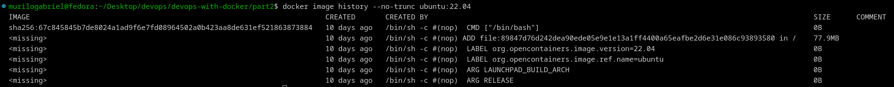

# Official Images and trust

In this module, we are introduced on how to track the building process of an official image by the Docker Hub. By analysing the Dockerfile of Ubuntu's image, we can confirm:

~~~dockerfile
FROM scratch #empty image
ARG RELEASE #build-time variable
ARG LAUNCHPAD_BUILD_ARCH
LABEL org.opencontainers.image.ref.name="ubuntu" #metadata
LABEL org.opencontainers.image.version=$RELEASE
ADD ubuntu-*-oci-$LAUNCHPAD_BUILD_ARCH-root.tar.gz / #if needs, decompress and save into container's directory
CMD ["/bin/bash"]
~~~

The official [documentation](https://git.launchpad.net/cloud-images/+oci/ubuntu-base/tree/Dockerfile?h=jammy-22.04) shows the SHA256 digest attached to the image. Let's check locally with the commands:
~~~bash
docker pull ubuntu:22,04 && docker image ls --digests
~~~

A different hash is returned:
~~~txt
ubuntu      22.04       sha256:19478ce7fc2ffbce89df29fea5725a8d12e57de52eb9ea570890dc5852aac1ac
~~~

Well, let's check the directives. It does not show because the output is truncated:

~~~bash
docker image history --no-trunc ubuntu:22.04
~~~

Then, we get:

Therefore, the Dockerfile's instructions match.