# Deployment pipelines

In this module, we will learn how to automatically deploy some containerized applications after testing and modifications. This minimize downtime from a patch or test made manually before to push into production, this automation is called **CI/CD pipeline**.

For this, versioning code is the cornerstone. In that way, multiple softwares capable of CI/CD mostly based on **git**. We will get into **GitHub Actions**:

~~~yml
name: Release DevOps with Docker # Name of the workflow

# On a push to the branch named master
on:
  push:
    branches:
      - master

# Job called build runs-on ubuntu-latest
jobs:
  deploy:
    name: Deploy to GitHub Pages #deploying the page as a GitHub page
    # we are not interested in this job

  publish-docker-hub:
    name: Publish image to Docker Hub
    runs-on: ubuntu-latest #runner
    steps:
    # Checkout to the repository
    - uses: actions/checkout@v2 #ready-made action

    # We need to login so we can later push the image without issues.
    - name: Login to Docker Hub
      uses: docker/login-action@v1 #official Docker action
      with:
        username: ${{ secrets.DOCKERHUB_USERNAME }}
        password: ${{ secrets.DOCKERHUB_TOKEN }}
    # Builds devopsdockeruh/docker-hy.github.io
    - name: Build and push
      uses: docker/build-push-action@v2 #official Docker action
      with:
        push: true
        tags: devopsdockeruh/coursepage:latest #image to be pushed
~~~

Three definitions were important to understand: **workflow**, **job**, **runner**, **action** and **secret**:
- *Workflow*: configurable automated processes that run or more jobs
- *Job*: actual automated process to be made
- *Runner*: who will execute the process
- *Action*: hosted instructions to get the proccess done
- *Secret*: important variables that are kept at the remote repository

The tool **Watchtower** were introduced to automate base image updates into Docker Hub by pulling it and applying the changes.

## Exercise 3.1: Your pipeline

First, we clone the repository and build the image tagged in mind to get pushed into Docker Hub:
~~~bash
docker build express-app/ -t muriloleal/nodejs-app
~~~

So, we can list the images and see:

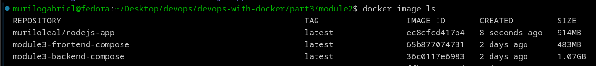

It runned well. After that, we formulate the *nodejs-app.yml* file already at .github/workflows directory. It's the same as the one defined in the module, but we need to change the **action's version**, the **main** branch and the **tag** that references the image to be pushed:

~~~yml
name: Release Node.js app

on:
  push:
    branches:
      - main

jobs:
  publish:
    runs-on: ubuntu-latest
    steps:
      - uses: actions/checkout@v4
      - name: Login to Docker Hub
        uses: docker/login-action@v3
        with:
          username: ${{ secrets.DOCKERHUB_USERNAME }}
          password: ${{ secrets.DOCKERHUB_TOKEN }}
      - name: Build and push
        uses: docker/build-push-action@v5
        with:
          push: true
          tags: muriloleal/nodejs-app:latest
~~~

Something is missing, and it is the GitHub secrets. We go at the Docker Hub's page to generate a token for GitHub Actions:

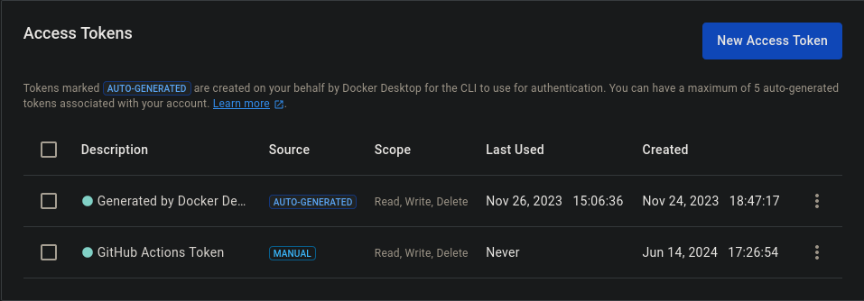

We copy the token and create some repositories to store the secrets:

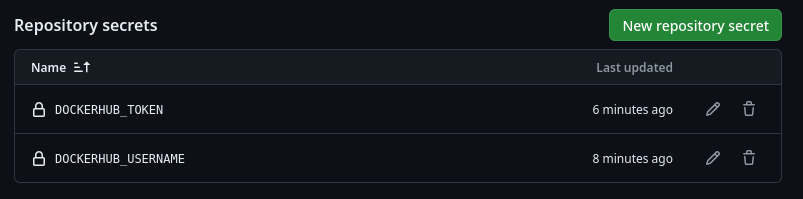

Then, it's time to test:
**SPOILER**: Several errors occurred because I did not know that the *.github* folder must be at the root directory of the repository.

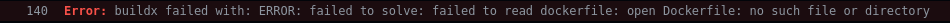

Well, I must pass the **context** field. It is the full directory where should build the image. Renaming it:

~~~yml
with:
    context: part3/module2/express-app
    push: true
    tags: muriloleal/nodejs-app:latest
~~~

Let's see:

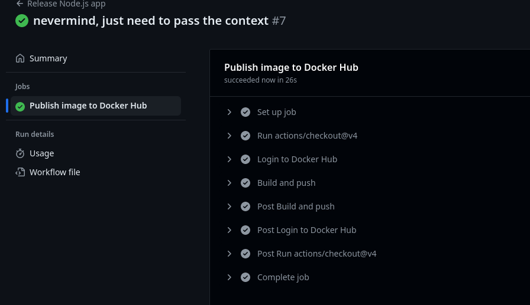

It worked! At Docker Hub's page:

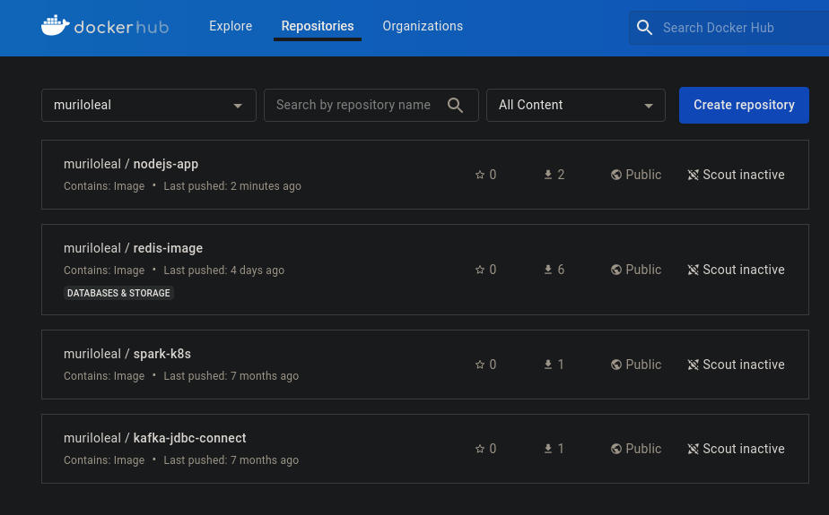

We run at the terminal to test the image:
~~~bash
docker run -d -p 8080:8080 muriloleal/nodejs-app 
~~~

In the browser:

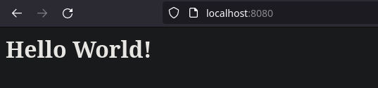

So, it's all set. Now, let's define the *docker-compose.yml* in a way that **Watchtower** keeps monitoring the *Nodejs* application:

~~~yml

services:
  nodejs-app:
    image: muriloleal/nodejs-app:latest
    ports:
      - 8080:8080
  watchtower:
    image: containrrr/watchtower
    environment:
      -  WATCHTOWER_POLL_INTERVAL=60 # Poll every 60 seconds
    volumes:
      - /var/run/docker.sock:/var/run/docker.sock:ro
    container_name: watchtower
~~~

Running *docker compose up*, we can see the Watchtower monitoring the Nodejs instance:

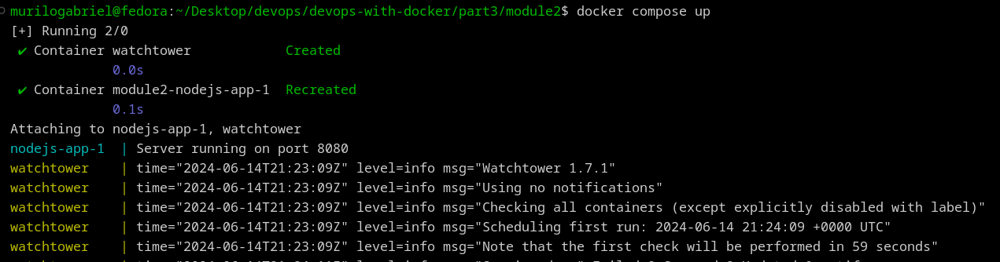

Now, I change the *index.js* text and wait for the Watchtower capture and GitHub Actions workflow. After some time:

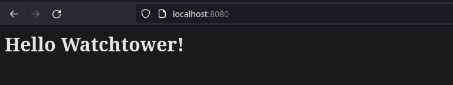

The changes were propagated.

## Exercise 3.3: Scripting magic

With shell script it turns easy because we just need to use the well known docker commands:

~~~sh
#clone.sh
git clone https://github.com/$1 example-shell;
sleep 1;
cd example-shell;
docker build . -t $2;
docker push $2;
~~~

In this script, the first argument is related to Github repository, and the second the tag for the image to be pushed into Docker Hub. Checking the command:
~~~bash
sh ./clone.sh mluukkai/express_app muriloleal/shell-clone-git
~~~

The result is shown:

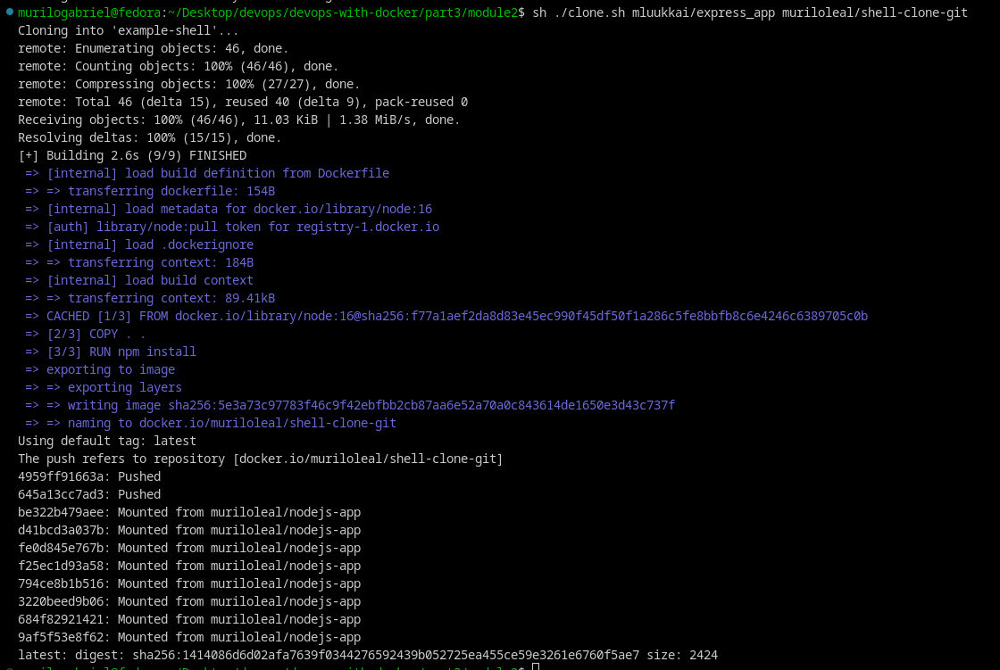

In Docker Hub:

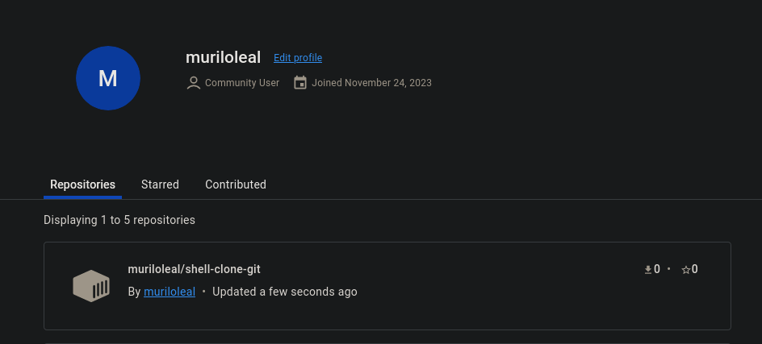

## Exercise 3.4: Building images from inside of a container

Interesting points were stated. If we pass the file that handles Docker sockets to a container, it becames able to perform Docker commands. As seen previously, we just need to specify the Dockerfile in a way to copy the *clone.sh* file, define the *sh -c ./clone.sh* as entrypoint and awaits for the user arguments:
~~~dockerfile
FROM docker

COPY ./clone.sh .

ENV DOCKER_USER=muriloleal
ENV DOCKER_PWD=###########

ENTRYPOINT ["sh", "./clone.sh"] 
~~~

Let's build and check:
~~~bash
docker build . -t docker-inside-docker
docker run docker-inside-docker -v /var/run/docker.sock:/var/run/docker.sock muriloleal/redisimage muriloleal/docker-inside-docker
~~~

An error occurred because we don't logged into Docker account with *docker login* command. So, let's add one line into *clone.sh*:
~~~bash
docker login -u $DOCKER_USER -p $DOCKER_PWD
~~~

Then, it should work:

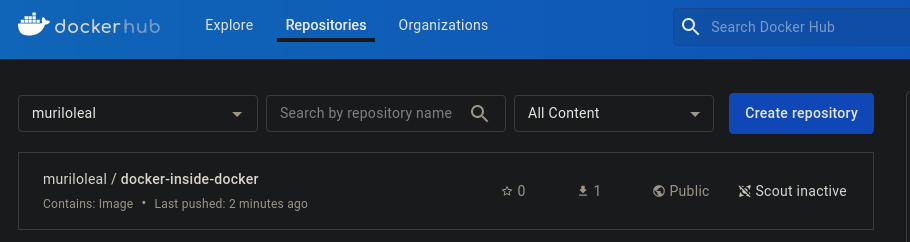

