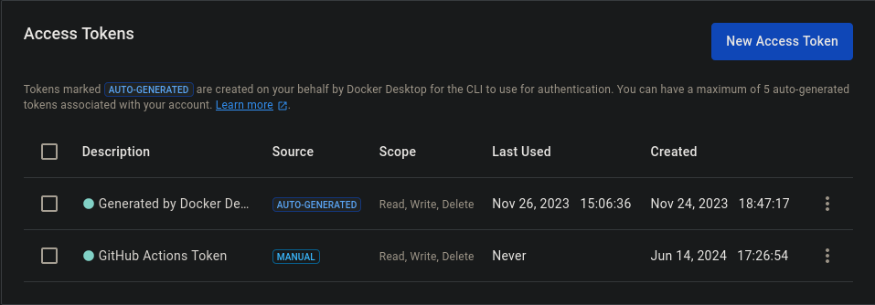
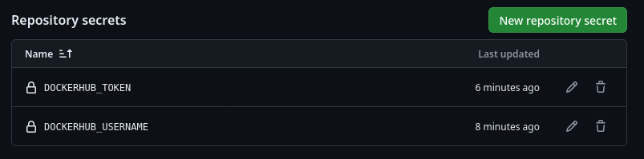

# Deployment pipelines

In this module, we will learn how to automatically deploy some containerized applications after testing and modifications. This minimize downtime from a patch or test made manually before to push into production, this automation is called **CI/CD pipeline**.

For this, versioning code is the cornerstone. In that way, multiple softwares capable of CI/CD mostly based on **git**. We will get into **GitHub Actions**:

~~~yml
name: Release DevOps with Docker # Name of the workflow

# On a push to the branch named master
on:
  push:
    branches:
      - master

# Job called build runs-on ubuntu-latest
jobs:
  deploy:
    name: Deploy to GitHub Pages #deploying the page as a GitHub page
    # we are not interested in this job

  publish-docker-hub:
    name: Publish image to Docker Hub
    runs-on: ubuntu-latest #runner
    steps:
    # Checkout to the repository
    - uses: actions/checkout@v2 #ready-made action

    # We need to login so we can later push the image without issues.
    - name: Login to Docker Hub
      uses: docker/login-action@v1 #official Docker action
      with:
        username: ${{ secrets.DOCKERHUB_USERNAME }}
        password: ${{ secrets.DOCKERHUB_TOKEN }}
    # Builds devopsdockeruh/docker-hy.github.io
    - name: Build and push
      uses: docker/build-push-action@v2 #official Docker action
      with:
        push: true
        tags: devopsdockeruh/coursepage:latest #image to be pushed
~~~

Three definitions were important to understand: **workflow**, **job**, **runner**, **action** and **secret**:
- *Workflow*: configurable automated processes that run or more jobs
- *Job*: actual automated process to be made
- *Runner*: who will execute the process
- *Action*: hosted instructions to get the proccess done
- *Secret*: important variables that are kept at the remote repository

The tool **Watchtower** were introduced to automate base image updates into Docker Hub by pulling it and applying the changes.

## Exercise 3.1: Your pipeline

First, we clone the repository and build the image tagged in mind to get pushed into Docker Hub:
~~~bash
docker build express-app/ -t muriloleal/nodejs-app
~~~

So, we can list the images and see:

It runned well. After that, we formulate the *deploy.yml* file already at .github/workflows directory. It's the same as the one defined in the module, but we need to change the **action's version**, the **main** branch and the **tag** that references the image to be pushed:

~~~yml
name: Release Node.js app

on:
  push:
    branches:
      - main

jobs:
  publish:
    runs-on: ubuntu-latest
    steps:
      - uses: actions/checkout@v4
      - name: Login to Docker Hub
        uses: docker/login-action@v3
        with:
          username: ${{ secrets.DOCKERHUB_USERNAME }}
          password: ${{ secrets.DOCKERHUB_TOKEN }}
      - name: Build and push
        uses: docker/build-push-action@v5
        with:
          push: true
          tags: muriloleal/nodejs-app:latest
~~~

Something is missing, and it is the GitHub secrets. We go at the Docker Hub's page to generate a token for GitHub Actions:

We copy the token and create some repositories to store the secrets:

Then, it's time to test:
**SPOILER**: Several errors occurred because I did not know that the *.github* folder must be at the root directory of the repository.

Well, I misunderstood the **tag** concept. It is the directory where should build the image. Renaming it:

~~~yml
with:
    push: true
    tags: part3/module2/express-app:latest