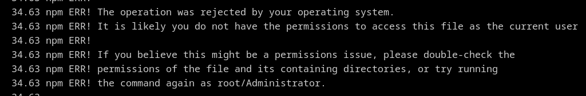
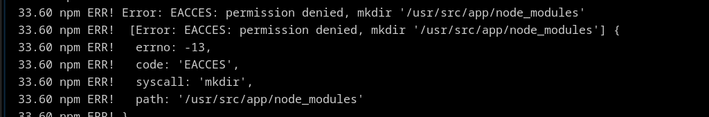
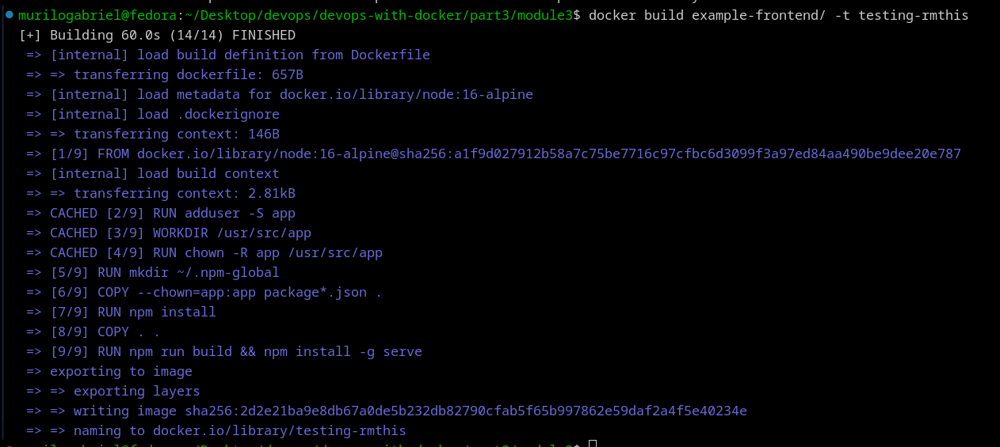
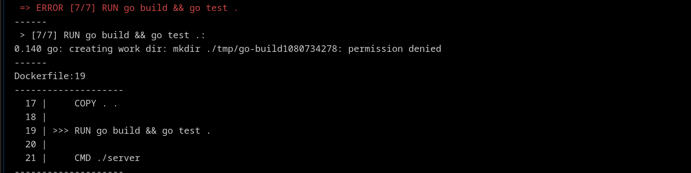
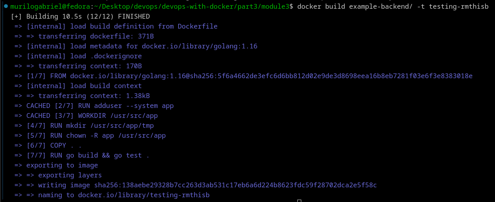

# Using a non-root user

A user possess permissions that limit the access of commands and processes. This is important to avoid security extrapolation and it is applicable in Docker containers. Exist two ways to mitigate these privileges:
- Assign a non-root user
- Map to a non-existing user on the host
  
At Dockerfile's level, a user is defined with shell commands:
~~~dockerfile
RUN useradd -m appuser
RUN chown appuser . #if needed
USER appuser #change the user
~~~

## Exercise 3.5

For Alpine-based distributions, the user creation is made by **adduser** command:
~~~dockerfile
RUN adduser -D app 
USER app
~~~

This alone what not enough of permissions, as we can see the error occurred when tried to build the image:

The user were not able to execute **npm** commands. Let's give him some permissions:
~~~dockerfile
RUN chown -R app ~/.npm #recursive permission for npm process
~~~

Another error:

So, let's create the directory and **chown** to the user:
~~~dockerfile
RUN chown -R app /usr/src/app
~~~

To avoid give some privileges to access /usr/local folder, I pointed to another *.npm* folder for global installations and in that way it does not require root access:
~~~dockerfile
#RUN chown -R app ~/.npm #recursive permission for npm process
RUN mkdir ~/.npm-global
ENV NPM_CONFIG_PREFIX=~/.npm-global
~~~

Copying the packages gives error. For that, we actually copy the *package.json* files with chown command:
~~~dockerfile
COPY --chown=app:app package*.json .
~~~
It gives a specific permission to pass the package files. Then, it should work:

For the backend application, we do the same thing:
~~~dockerfile
RUN adduser --system app
USER app
~~~

The first error show a hint of what permissions we should grant to the user:

It actually need permission to create and manipulate a **temporary** folder. We create one inside the working directory, modify the environment variable that points to the *tmp* folder and then give *chown* command to the folder:
~~~dockerfile
RUN mkdir /usr/src/app/tmp
ENV GOTMPDIR=/usr/src/app/tmp
RUN chown -R app /usr/src/app
~~~

It should work:

