# Optimizing the image size

The image size and building/pulling proccess is important to mitigate security attacks and optimize time and size. To build an image, this is done in **layers** in a way that several layers can be cached, and future changes can only apply to certain layer. Some tips introduced:
- Use **Alpine** images and add only necessary features
- Minimize layers used to build encompassing several *RUN* commands in the same field
- Bind versions to packages for resiliency
- Clean unused directories and packages

## Exercise 3.6
  
First, let's check the current image sizes. I renamed the past images that I implemented using *users*:

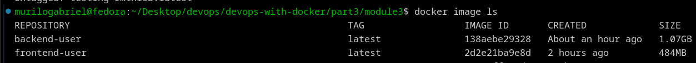

Now, some changes to the Dockerfiles. Merging run commands:
~~~dockerfile
#frontend
RUN chown -R app /usr/src/app && mkdir ~/.npm-global 
RUN npm install && npm run build && npm install -g serve

#backend
RUN mkdir /usr/src/app/tmp && chown -R app /usr/src/app
~~~

In frontend's Dockerfile, the *COPY* command is redundant, it's enough just copy all the files in chown mode:
~~~dockerfile
COPY --chown=app . .
~~~

A package called **node-prune** automates the clean of node_modules after use. So, I curl it and leaves prepared. Also, I prune all the cached packages:
~~~dockerfile
RUN chown -R app /usr/src/app && mkdir ~/.npm-global && apk add curl && \
    curl -sf https://gobinaries.com/tj/node-prune | sh && apk del curl && \
    rm -rf /var/cache/apk/*
~~~

Finally, I run the command at the end of the build proccess:
~~~dockerfile
RUN npm install && npm run build && npm install -g serve && \
    node-prune /usr/src/app/node_modules
~~~

The size has been reduced by **33MB**:

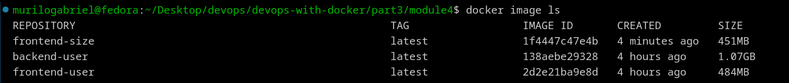

For backend image, the *RUN* commands are already joined and I don't see other ways to improve that only based by these fields. The solution would be use **alpine** distros and **multi-stage** build:
~~~dockerfile
FROM golang:1.16

EXPOSE 8080

RUN adduser --system app

WORKDIR /usr/src/app

RUN mkdir /usr/src/app/tmp && chown -R app /usr/src/app
ENV GOTMPDIR=/usr/src/app/tmp

#ENV REQUEST_ORIGIN="http://localhost:5000"
USER app

COPY . . 

RUN go build && go test .

CMD ./server
~~~

## Exercies 3.7

Well, actually the frontend image is already using Alpine variant for Node.js. Let's use one for the backend application:

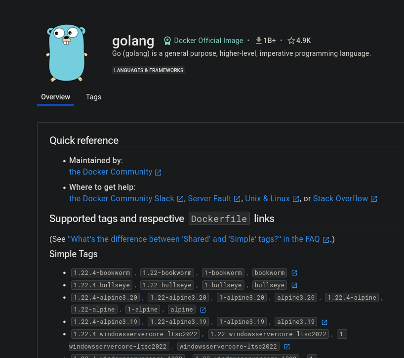

Clearly, the Alpine versions are standardized as **golang:version-alpine**. So, let's test it:
~~~dockerfile
FROM golang:1.16-alpine
~~~

An error were shown:

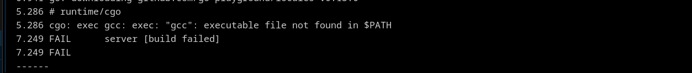

Found out that needs **gcc** and **musl-dev** packages, installed it:
~~~dockerfile
RUN mkdir /usr/src/app/tmp && chown -R app /usr/src/app && \
    apk add --no-cache gcc musl-dev
~~~

It should work:

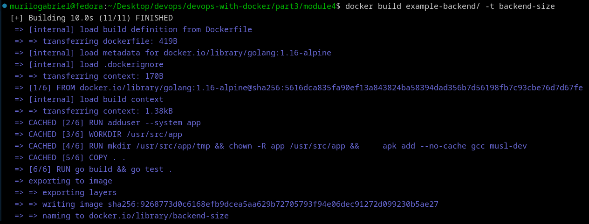

Checking the size difference:

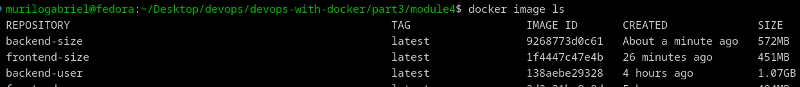

Almost half size difference!

## Exercise 3.8: Multi-stage frontend

To frontend, we need to separate the **npm build proccess** and the **serve static files proccess**. We begin with the *builder* image:
~~~dockerfile
FROM node:16-alpine as builder

RUN adduser -S builder
WORKDIR /build
RUN chown -R builder /build && mkdir ~/.npm-global && apk add curl && \
    curl -sf https://gobinaries.com/tj/node-prune | sh && apk del curl && \
    rm -rf /var/cache/apk/*
ENV NPM_CONFIG_PREFIX=~/.npm-global

USER builder

COPY --chown=builder . .

RUN npm install && npm run build && npm install -g serve
~~~

It actually does the majority of the task, all the modules were built at */build* directory. After that, the runner image must grab this modules and just serve:
~~~dockerfile
FROM node:16-alpine

RUN adduser -S app

EXPOSE 5000
WORKDIR /app

USER app

COPY --chown=app --from=builder /build/node_modules ./node_modules

CMD serve -s -l 5000 build
~~~

Let's check if it builds successfully:

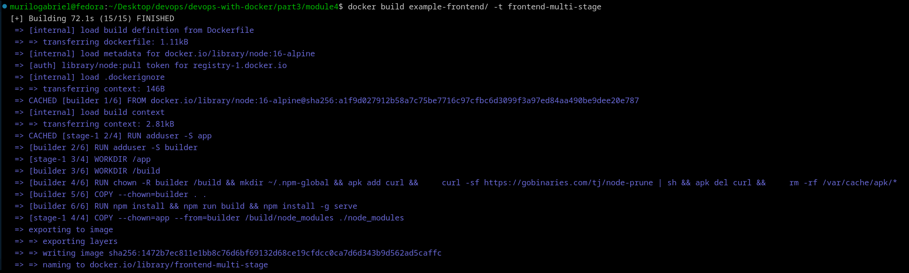

Great! And the image size?

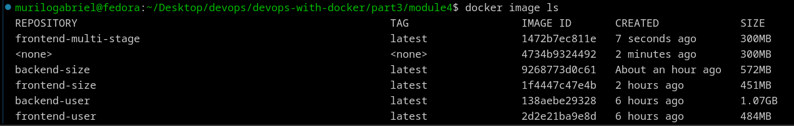

Way smaller, turned into **300MB**.

## Exercise 3.9: Multi-stage backend

**Scratch** image make security easier due to it's extremely limitations. Actually, it's just to act as a **runner** from a built image. In that way, we mantain the build proccess from the current Golang image:
~~~dockerfile
FROM golang:1.16-alpine as builder

RUN adduser --system builder

WORKDIR /build

RUN mkdir /build/tmp && chown -R builder /build && \
    apk add --no-cache gcc musl-dev
ENV GOTMPDIR=/build/tmp

USER builder

COPY . . 

RUN go build && go test .
~~~

Therefore, just remains to run the executable already created:
~~~dockerfile
FROM scratch

EXPOSE 8080
WORKDIR /app

COPY --from=builder /build .

CMD ["./server"]
~~~

Let's check:

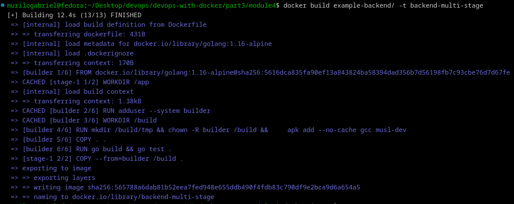

More important, your size:

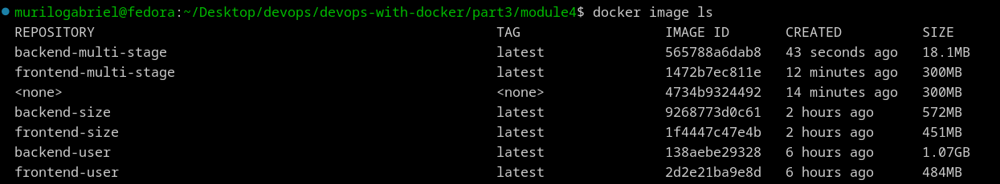

Only **18.1MB**...

## Exercise 3.10

The *Golang* backend application shrinking size was so shocking that I will use a **Hello World** example from [here](https://gobyexample.com/hello-world), containerize it and optimize your image. I will start just pack this into a Dockerfile:
~~~dockerfile

FROM golang

WORKDIR /app

COPY . .

RUN go build -o test main.go

EXPOSE 8000

CMD ./test
~~~

Build and test:

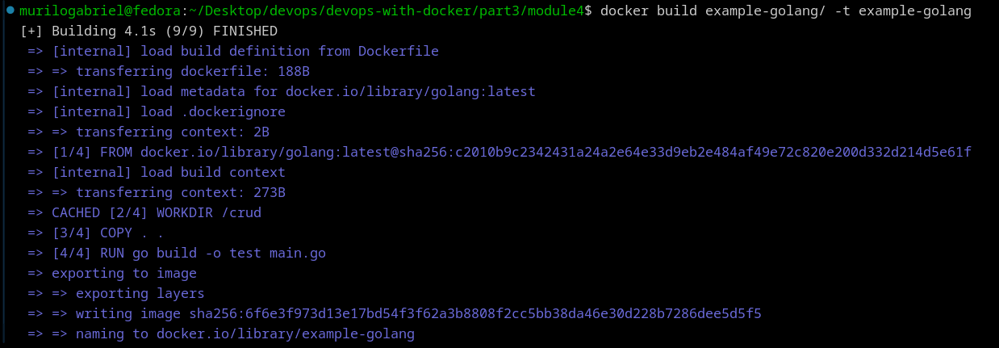

Nice, let's run the image and see if it works:

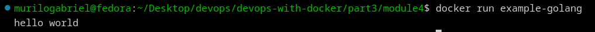

So far so good, but looking into it's size...

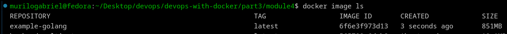

First of all, I will select a **alpine** variant of Golang image and run:
~~~dockerfile
FROM golang:alpine
~~~

If I see again it's size:

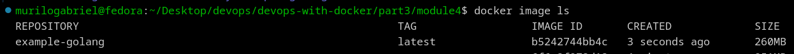

Half of it has gone. Let's add some security precautions while using non-root user:
~~~dockerfile
WORKDIR /app
RUN adduser --system hello && chown -R hello /app
USER hello
~~~

Finally, it's time for **multi-stage** it:
~~~dockerfile
FROM golang:alpine as builder

WORKDIR /build

RUN adduser --system builder && chown -R builder /build

USER builder

COPY . .

RUN go build -o test main.go

FROM scratch

WORKDIR /app
COPY --from=builder /build/test ./

EXPOSE 8000

CMD ["./test"]
~~~

This time I just copied the executable to the runner image. Testing it:

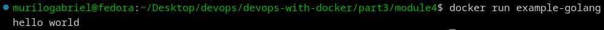

Cool, and the size?

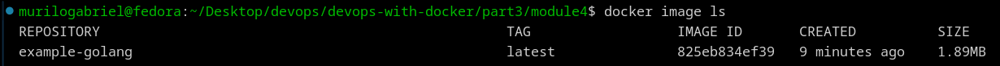

Just **1.89MB**.