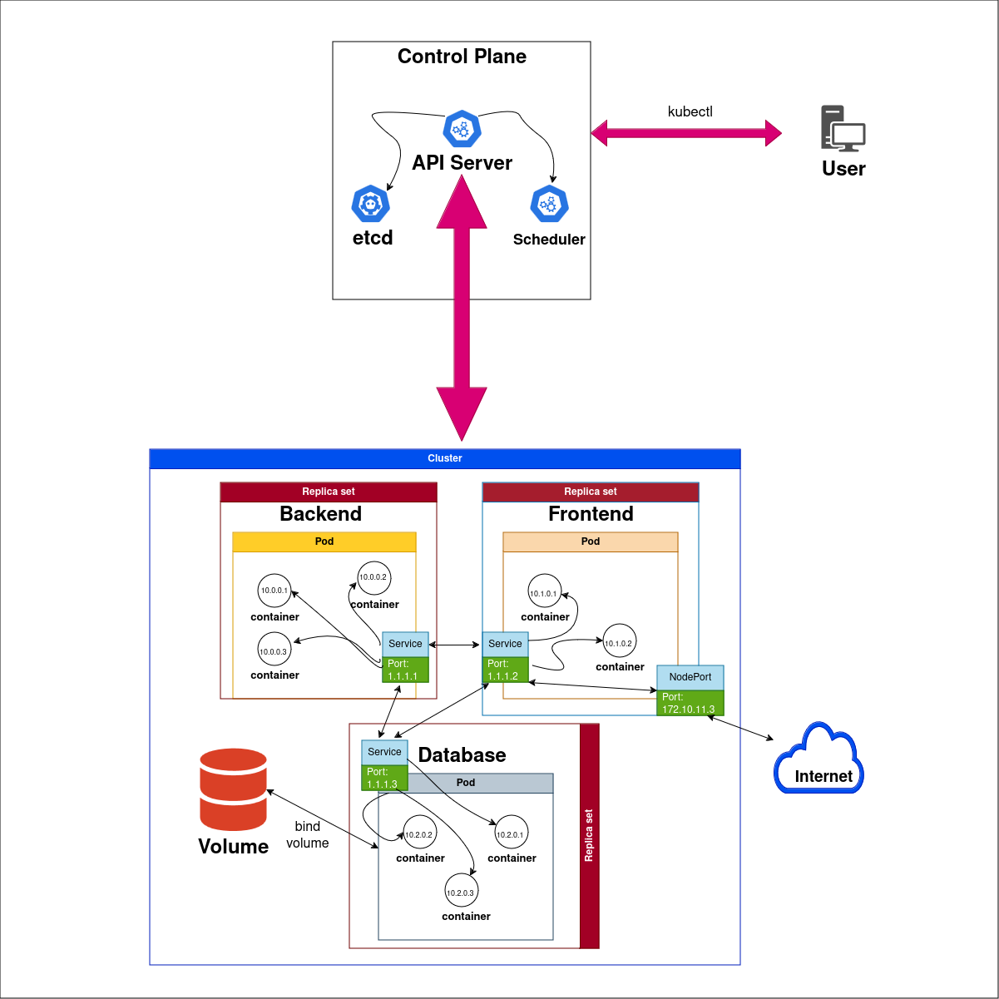

# Multi-host environments

Manage a pool of containers is a difficult task. For that, we can use **Docker swarm** and **Kubernetes**. With them, it's possible scale and deploy multiple instances in a multi-host environment.

## Exercise 3.11
The diagram is modeled:

It's a simple web architecture controlled by Kubernetes. **Pod** is set of containers and it is who has scaling instructions conducted by **Replica set**. Each container in Pod has it's own internal IP, the communication is propagated by a **Service** filliated with the Pod, like a NAT function.

The set of Pods defines the **Cluster**, and it is what is modified by **Control Plane**, the actual orchestrator that applies changes and monitors rules. The Control Plane has some service under your guard, for example the **Scheduler**, **etcd** and **API Server**:
- Scheduler: as the name says, can apply configurations based in time
- etcd: key-value store for crittical information
- API Server: interface between user and cluster, it is here where **kubectl** commands go

The **NodePort** is one of the services that exposes some application to the internet, others are **Load Balancer** and **Ingress**. They appoint traffic into the Pods.

The **Volume** is attached to one or more Pods and it is binded with a container volume, in that way it persists for access by the host.